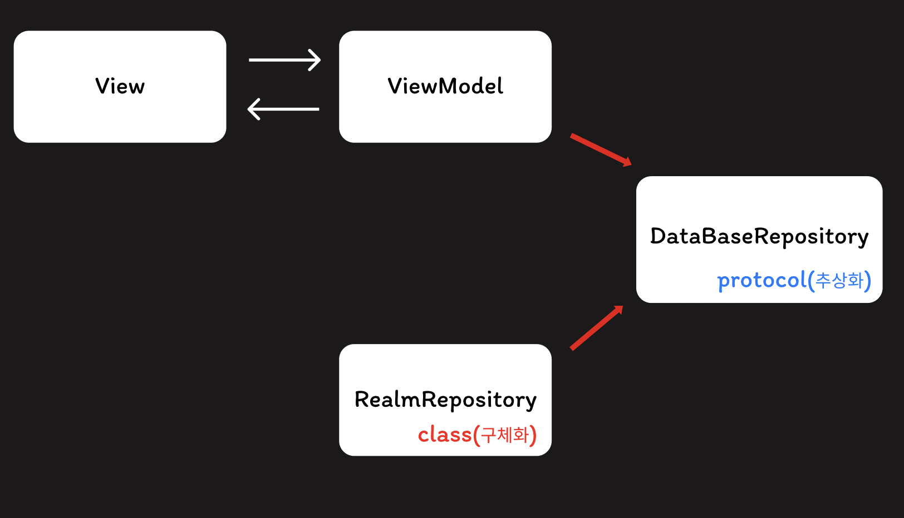

# ☀️ 모닝글로리 
- 아침형 인간이 되고픈, 부지런한 삶을 살아가고 싶은 사람들을 위한 미라클 모닝 가이드앱

    
    
    
# 🙋‍♀️ 프로젝트 주요 기능 
- 닉네임, 프로필 사진 커스텀
- 유저에게 실시간 날씨와 하루에 명언 한 줄 제공
- 미션 입력, 기상시간 체크
- 미션 완료 시, 달력에 확인표시 기능
- 차트를 통해 진행률 표시
- 후기 글, 사진 포스트/삭제

    

# 🧑🏻‍💻 프로젝트 개발환경
- 1인 개발(iOS)
- 개발기간: 2024.09.12 ~ 2024.09.27(약 2주, 버전 1.0 기준)
- iOS 최소 버전: iOS 15.0+   

    

   
# 🛠 프로젝트 기술스택
- 아키텍처 및 데이터 관리
    - MVVM (Model-View-ViewModel)
    - MVI (Model-View-Intent)
    - Realm
    - Combine
    - Repository Pattern 

- 네트워킹 및 데이터 처리
    - Alamofire
    - Kingfisher
- UI 구성 및 사용자 인터페이스
    - SwiftUI
    - Charts
    - WidgetKit
- 앱 모니터링 및 분석
    - Firebase Crashlytics
    - Firebase Analytics

    
# 👉  상세 기능 구현 설명

### - Realm 데이터 관리 및 UI업데이트 설계

- Realm의 데이터 변경 사항을 자동으로 UI에 반영할 수 있도록 ObservedRealmObject와 ObservedObject를 활용하여 구현.  
- 데이터관리를 위한 RealmRepository를 여러 ViewModel에서 사용하고, 테스트 용이성과 코드 구현에 있어 유연성 향상을 위해 DIP를 적용 
- ViewModel이 RealmRepository의 구체적인 구현에 의존하지 않고, DataBaseRepository라는 프로토콜을 사용해 추상화에 의존하도록 구현

### - 데이터 상태 변화 관리
  - 데이터의 상태 변화를 Combine의 PassthroughSubject를 통해  제어
  - Input: 사용자로부터의 날짜 변경 또는 미션 완료와 같은 이벤트를 PassthroughSubject로 처리 
- Output: 현재 날짜와 필터링된 미션 리스트 등, View에서 표시할 데이터를 포함, @Published를 사용하여 View에 바인딩할 수 있도록 상태 변화를 관리

### - 이미지 파일 관리
- 이미지 저장 시, 파일 크기를 줄이기 위해 압축된 JPEG 형식으로 Document Directory에 저장
- 이미지 로드 시, 파일이 존재하면 UIImage 객체를 생성해 반환, nil일 경우 대체 이미지 반환
- 이미지 삭제 시, 파일이 존재하는지 확인 후, 해당파일 삭제   
  - 이미지 먼저 삭제 후, Realm 데이터 삭제 순서에 유의

### - 사용자 위치 관리
- requestWhenInUseAuthorization()을 통해 사용자로부터 위치 추적에 대한 권한 상태 설정
- didChangeAuthorization 델리게이트 메서드를 통해 사용자의 위치 권한 변경에 대응
- 사용자에게 해당 위치에 대한 날씨 제공을 위해 CoreLocation을 활용하여 사용자 위치 정보 처리
- CLLocationManager를 활용하여 사용자의 위치 지속적으로 업데이트

    
# 👿 트러블슈팅 😈

## 두 개 이상의 구조체에서 하나의 ViewModel을 공유하려면?

## 데이터 전달 오류

