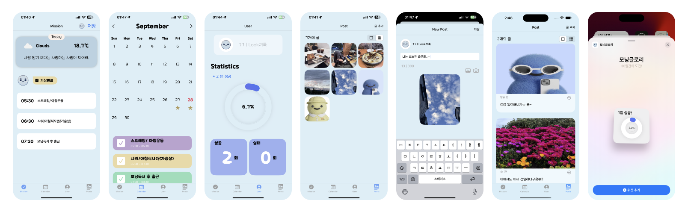

# ☀️ 모닝글로리 
- 아침형 인간이 되고픈, 부지런한 삶을 살아가고 싶은 사람들을 위한 미라클 모닝 가이드앱

    
     
    
# 🙋‍♀️ 프로젝트 주요 기능 
- 닉네임, 프로필 사진 커스텀
- 유저에게 실시간 날씨와 명언 표시
- 미션 입력, 기상시간 체크
- 미션 완료 시, 달력에 확인표시 기능
- 차트를 통해 진행률 표시
- 후기 글, 사진 포스트/삭제

    

# 🧑🏻‍💻 프로젝트 개발환경
- 1인 개발(iOS)
- 개발기간: 2024.09.12 ~ 2024.09.27(약 2주, 버전 1.0 기준)
- iOS 최소 버전: iOS 15.0+   

    

   
# 🛠 프로젝트 기술스택
    

- 아키텍처 및 디자인 패턴: MVVM, MVI, Combine, Repository Pattern

- 네트워킹 및 데이터 처리: Alamofire, Realm
- UI 및 이미지 처리: SwiftUI, Charts, WidgetKit
- 앱 모니터링 및 분석: Firebase Crashlytics, Firebase Analytics

    

# 👉  상세 기능 구현 설명

### - Realm 데이터 관리 및 UI업데이트 설계

- 테스트 용이성과 코드 구현에 있어 유연성 향상을 위해 DIP를 적용해, 여러개의 ViewModel이 구체적인 구현에 의존하지 않고, 추상화에 의존하도록 구현

 

### - 데이터 상태 변화 관리
  - 데이터의 상태 변화를 Combine의 PassthroughSubject를 통해 제어

 

### - 이미지 파일 관리

- 화질이 중요한 게시글 이미지의 경우 pngData로 압축 저장하여 이미지 용량 축소
- 썸네일의 경우 dataType으로 전환 시, pngData: 31kb, jpeg: 22kb 로 거의 차이가 없어 화질이 선명한 pngData로 압축

 

### - 사용자 위치 관리
- 사용자 위치 정보 처리 : CoreLocation을 사용하여 위치 정보 기반 날씨 데이터 제공
- 위치 업데이트: CLLocationManager를 사용하여 사용자의 위치를 지속적으로 업데이트하고 관리

 

### - 컴파일 최적화
 - private을 통해 외부 접근을 제한하여 캡슐화를 강화하고, final를 통해 클래스와 메서드가 상속되지 않게 선언해 메서드 호출을 인라인으로 대체하여 코드 최적화 수행
 

### - 앱 안정성 향상
  - Firebase Analytics를 통해 사용자 행동을 분석하고, Crashlytics로 오류 모니터링

    
# 👿 트러블슈팅 

## 이미지를 저장할때마다 메모리 용량 기하급수적으로 증가

